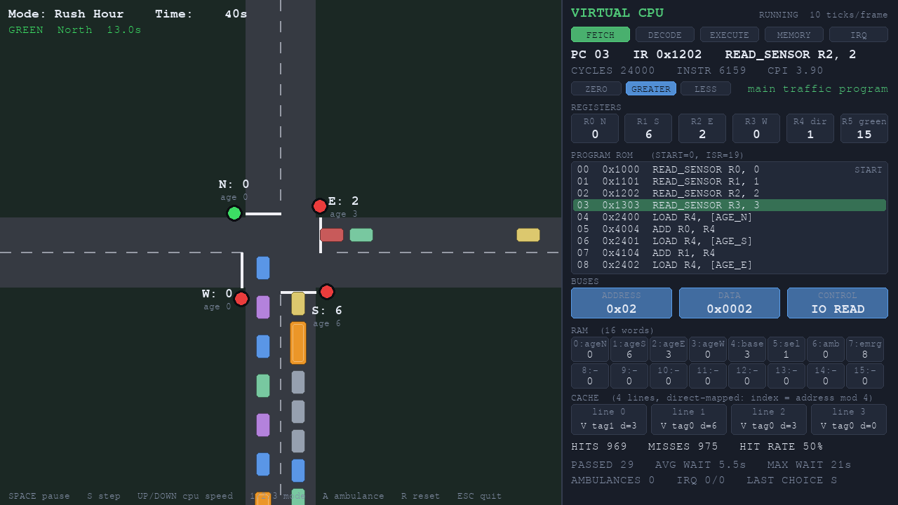
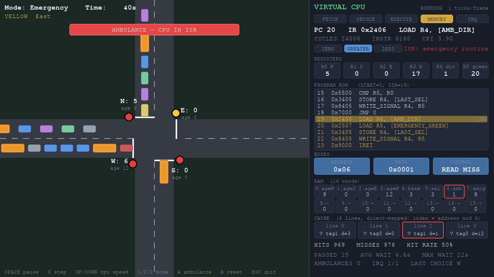

# SmartTraffic-CO

Educational smart traffic simulation that demonstrates **Computer Organization**
concepts: CPU, registers, ALU, fetch-decode-execute, RAM, cache, buses, I/O and
interrupts. The traffic light decision is *computed by a virtual CPU*, not faked.

> Simulation only. It does not control real traffic.

## Run

    python -m venv .venv
    # activate: Windows  .venv\Scripts\activate    macOS/Linux  source .venv/bin/activate
    pip install -r requirements.txt
    python main.py

Options: `python main.py --mode "Rush Hour"`, `--seed 5` (repeatable run),
`--frames 600 --screenshot screenshots/x.png` (save a picture and quit).

## Controls

| Key | Action |
|-----|--------|
| SPACE | pause / resume everything |
| S | while paused: execute ONE instruction (great for the viva) |
| UP / DOWN | CPU speed: 1 to 100 clock ticks per frame |
| 1 / 2 / 3 | Normal / Rush Hour / Emergency mode |
| A | send an ambulance from a random road |
| R | reset |
| ESC | quit |

## How it works

1. Vehicles arrive on four roads. **Sensors** count vehicles before each stop line.
2. A **virtual CPU** loops through a 19-instruction program: `READ_SENSOR` the
   four counts, `LOAD`/`ADD` a waiting-time bonus from RAM, `MAX` (ALU) picks the
   busiest road, `WRITE_SIGNAL` asks the lights for a green phase.
3. An **ambulance** raises an interrupt. The CPU saves its state, runs the 5-line
   ISR (priority green), and `IRET` restores the state.
4. The dashboard shows PC, IR, phase, registers, flags, buses, RAM, cache and stats live.

## Files

    main.py             window, keyboard, game loop
    src/config.py       every setting
    src/traffic.py      roads, vehicles, signal, sensors (no pygame)
    src/cpu.py          registers, ALU, assembler, fetch-decode-execute
    src/memory.py       RAM, 4-line cache, buses
    src/interrupts.py   interrupt controller + ambulance ISR
    src/controller.py   the traffic program + wiring (SmartTrafficSystem)
    src/dashboard.py    all drawing
    tests/              67 unit tests

## Tests

    python -m unittest discover -v

See `docs/architecture.md`, `docs/viva.md` and `docs/git.md`.
